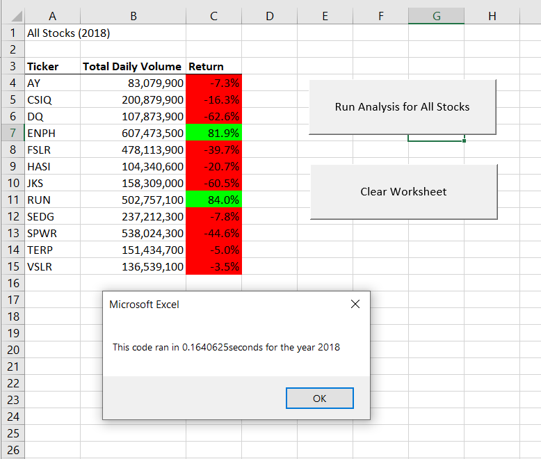
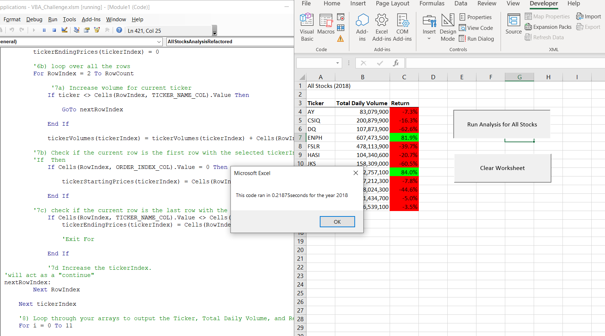
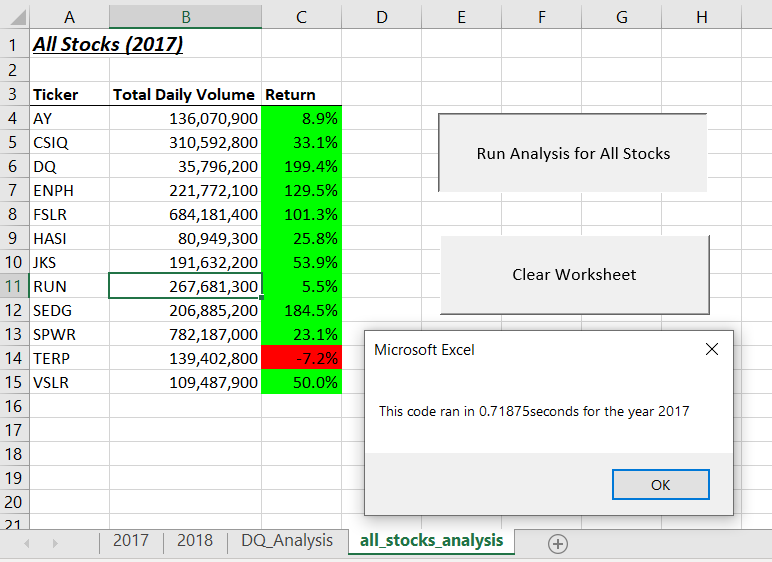
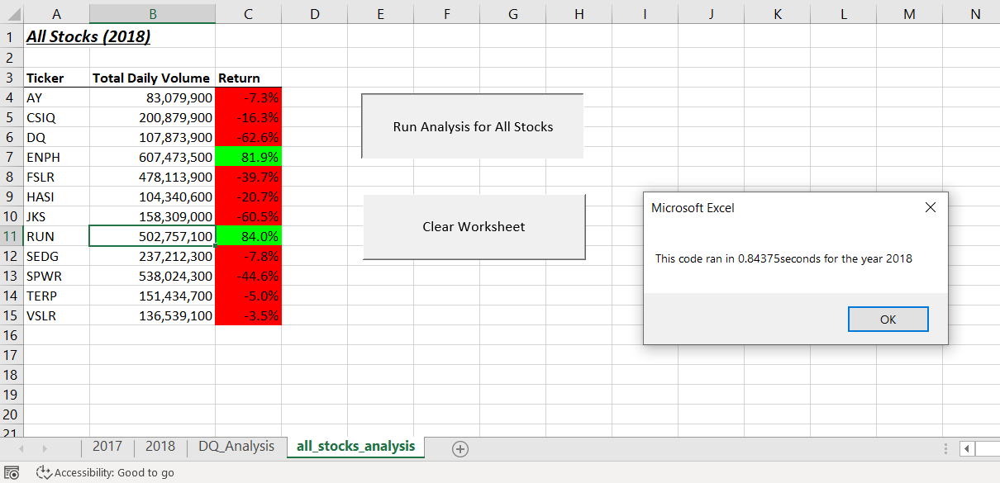
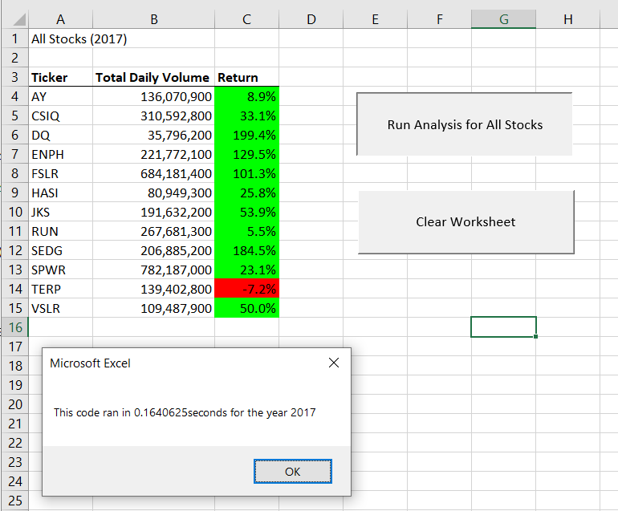
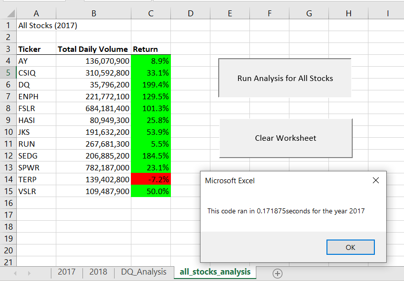
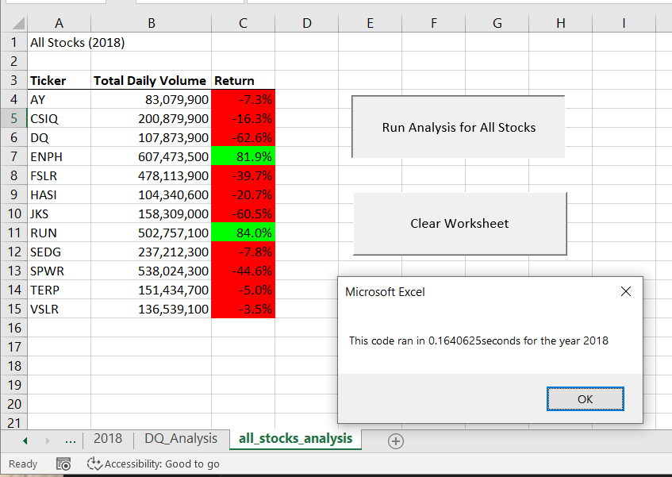

# Stock Excel Challenge

## Overview of Project

This project uses VBA to refactor code written to analyze data from the stock market in Excel.
The refactored code is designed to speed up processing of the dataset so that we can include larger datasets in the future.

### Purpose

Although the original code I wrote to analyze [stock market data in Excel](resources_homework/green_stocks.xlsm) was effective, it might not have worked as well for thousands of stock data, and if it did, it may have taken a long time to execute. 
Therefore, I edited my original code to help the VBA script run more efficiently – by taking fewer steps, using less memory and improving the logic of the code to make it easier for future users to understand.

## Analysis and Challenges

To refactor the code, I took my original code and looked for places to make it more efficient and improve on code comprehension.
I also set up constants to keep magic numbers from appearing in my code which makes refactoring and code comprehension easier.
Included in this section is an explanation of how I performed my analysis, followed by a section detailing the challenges I encountered and how I overcame them.

### Analysis of Stock Data Refactored

To refactor my code, I created a new macro subroutine titled: `AllStocksAnalysisRefactored()`I then set up constants for the columns I was using. 

```vb
ORDER_INDEX_COL = 1
TICKER_NAME_COL = 2
VOLUME_COL = 9
STARTING_COL = 7
ENDING_COL = 7
```

This helped me keep track of what I was using in my analysis and also allowed me to more efficiently debug the code if I accidentally selected the wrong column.

To start off the code, I added arrays for volume, start price and end price of the stocks. I renamed some variables to make it more readable, but used the original code I had set up from previous lessons.

To speed up the code, I added code from a google search to exit loops early. This cut down the total number of iterations from 36,000 (3,000 rows * 12 tickers) to 19,500 iterations (sum from n=1 to 12 of 250n). 

```vb
For TickerIndex = 0 To 11
	...
	For RowIndex = 2 To RowCount
        If ticker <> Cells(RowIndex, TICKER_NAME_COL).Value Then
        GoTo nextRowIndex        
    End If
	...
	If Cells(RowIndex, TICKER_NAME_COL).Value <> 	Cells(RowIndex + 1, TICKER_NAME_COL).Value Then
        tickerEndingPrices(TickerIndex) = Cells(RowIndex, ENDING_COL)
                
        'Googled VBA Exit For Loop --> ended up on this website to learn this trick
        'https://docs.microsoft.com/en-us/dotnet/visual-basic/language-reference/statements/exit-statement
        Exit For
    End If
nextRowIndex:
    Next RowIndex
Next TickerIndex
```
As you can see from the images below, removing the `Exit For` loop made the refactored code much slower.





I then realized that I did not refactor the order of the `For`loops (as instructed) and redid the work in a new macro subroutine `AllStocksAnalysisRefactored2()`.
In the second version, I created a new `For` loop only to zero out the volumes, starting and ending prices.
I also added exit early logic in the new nested `For` loop which keeps the iteration count the same as the first one (19,500).

```vb
For i = 0 To 11
    'zeroes everything out
    tickerVolumes(i) = 0
    tickerStartingPrices(i) = 0
    tickerEndingPrices(i) = 0
Next i

'5a) Create a tickerIndex variable and set it equal to zero before iterating over all the rows
For RowIndex = 2 To RowCount
    'searches for TickerIndex
    TickerIndex = 0
    For i = 0 To 11
        If Cells(RowIndex, TICKER_NAME_COL).Value = tickers(i) Then
            TickerIndex = i

            'Googled VBA Exit For Loop --> ended up on this website to learn this trick
            'https://docs.microsoft.com/en-us/dotnet/visual-basic/language-reference/statements/exit-statement
            Exit For
        End If
    Next i
...
Next RowIndex
```

### Challenges and Difficulties Encountered

I made the mistake of forging ahead without looking carefully at the instructions. I also had some challenges keeping track of which columns and rows I was using, so I set up the constant values. 

Part of what I struggle with is visualizing what I hope to accomplish.
In the future I will use pseudo-code and outlines as well as drawings to determine what steps I take.

## Results

The following images display the time it took to run the original code.





The first `AllStocksAnalysisRefactored()` churned out these results:




The second (and correct) refactor code produced these results:





As we can see, the results between the original and refactored code show that the refactored code was more effective.

## Summary

The advantages of refactoring code is that it usually makes it faster and more efficient. By taking fewer steps and using less memory, we can also improve the logic of the code to make it easier for future users to understand.

The downside of refactoring is that it can take a significant amount of time when the original code produced the results we wanted to find.

Compared with the original VBA script, the refactored ones were faster, more readable and more maintainable (easier to adjust for mistakes or updates). For instance, if I made a mistake in which column I wanted to use, I would not have to go through the code and manually change each row or column number -- I could just change the number associated with the constant at the top.